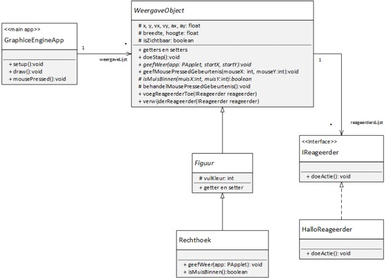
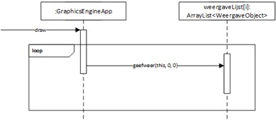
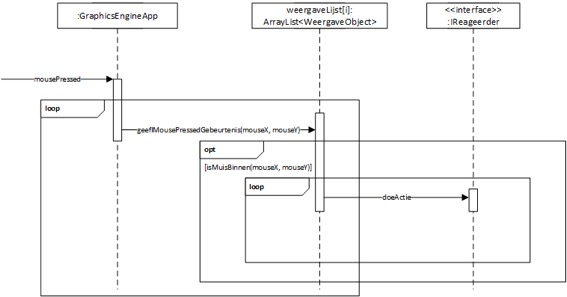

# Week 5 - les 14

# voorbereiding

## Opgave GraphicsEngine
*In deze opgave ga je een graphics engine ontwerpen. Hierbij komen een groot aantal technieken die je de afgelopen week hebt geleerd terug.
In de les ga je het ontwerp bespreken en verder uitwerken.*

### Omschrijving
*Bekijk onderstaande klassendiagram.*

*De GraphicsEngineApp houdt een lijst van Weergaveobject bij. In de draw methode van GraphicEngineApp wordt elk WeergaveObject getekend. Dit gebeurd door de methode geefWeer aan te roepen (die abstract is in WeergaveObject).*

*Zie onderstaand sequentiediagram. De parameters startX en startY kun je gebruiken als je het nulpunt van de PApplet waarop je de figuren tekent niet in de linkerbovenhoek wilt hebben. Deze twee parameters hebben we echt nodig als we deze applicatie gaan uitbreiden in de les.*

*Een WeergaveObject houdt een lijst van IReageerder bij. Er kunnen IReageerderobjecten worden toegevoegd en verwijderd.*

*Zodra er geklikt wordt op een WeergaveObject, voert dit object de doeActie uit van elke IReageerder die eraan gekoppeld is. Zie ook onderstaand sequentiediagram.*

*De HalloReageerder is een voorbeeld van een klasse die IReageerder implementeert. Deze Reageerder kan de String “hallo wereld” naar de console schrijven.*

### Opgave A
*Maak een nieuw project in Eclipse en maak de klassen en de interface uit het klassendiagram. Veel methoden heb je al in eerdere projecten gemaakt. Kopieer en plak de code uit de oude projecten naar de nieuwe klassen en test of het programma werkt.*

### Opgave B
*Implementeer de andere methoden op basis van bovenstaande beschrijving en test het programma door een instantie van Rechthoek te maken en deze te koppelen aan een HalloReageerder.*
